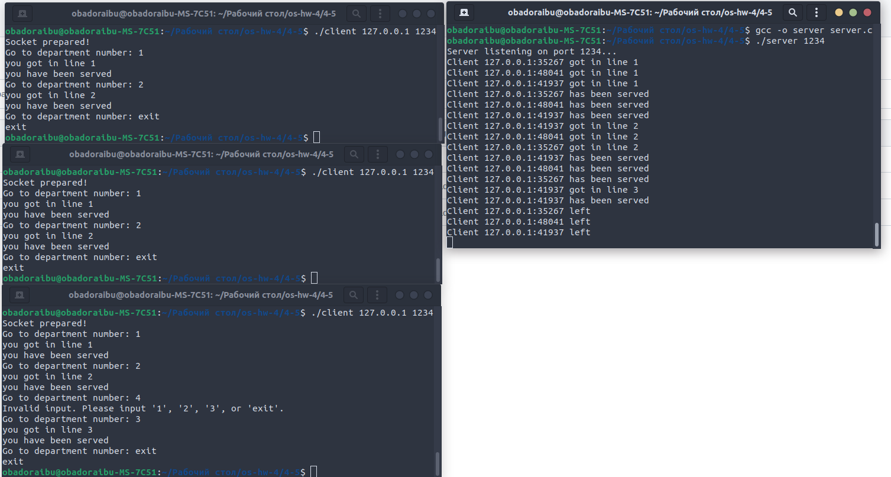
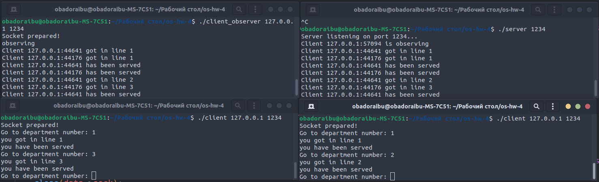

# os-hw-4
  Завяьлов Егор Сергеевич БПИ-217  Вариант 10

## 
Задача о магазине – 1. В магазине работают три отдела, каждый отдел обслуживает один продавец. Покупатель, зайдя в магазин, делает покупки в одном или нескольких произвольных отделах, обходя их в произвольном порядке. Если в выбранном отделе
продавец не свободен, покупатель становится в очередь и засыпает,
пока продавец не освободится. Создать приложение, моделирующее рабочий день магазина.

---- 
# 4-5
## Запуск:

Для тестирования и запуска программ необходимо,
находясь в нужной директории, ввести в терминал:

> gcc -o server server.c -lpthread;

> gcc -o client client.c;

> ./server port

В других окнах-клиентах:
> ./client ip port
## Модель задачи:
Сервер представляет собой магазин. В магазине работают 3 отдела(seller) реализованные с помощью pthread. Каждый отдел имеет свою очередь queue. Client играет роль покупателя. После получения сообщения от клиента оно в виде структуры data передается в функцию обработчик handle_client() в отдельном потоке. В зависимости от сообщения пользователя нода с struct sockaddr_in client_addr адресом клиента добавляется в конец очереди соответствующего продавца. Продавцы берут адрес из своей очереди, имитируют обслуживание с помощью sleep(5) и отправляют клтенту сообщение об успешном обслуживании, после чего переходят к следующему в очереди покупателю. Очереди реализованы самостоятельно для потокобезопасной работы с использованием pthread_mutex. Имя пользователя определяется из его ip.
  
  
## Демонстрация 
  ### 
  
# 6-7
## Запуск:

Для тестирования и запуска программ необходимо,
находясь в нужной директории, ввести в терминал:

> gcc -o server server.c -lpthread;

> gcc -o client client.c;

> gcc -o client_observer client_observer.c;

> ./server port

В других окнах-клиентах:
> ./client ip port

В других окнах-клиентах-наблюдателях:
> ./client_observer ip port
## Модель задачи:
Основная модель сохраняется из реализации на 4-5 баллов. В данной реализации добавлена работа с клиентом-наблюдателем(client_observer). В отличие от обычного клиента, наблюдатель добавляется в список observers. Когда происходит значимое действие во взаимодействии сервера и клиентов, вызывается функция broadcast_to_observers(), принимающая сообщенеие, которое направляется всем наблюдателям. Пример данных получаемых наблюдателем представлен в демонстрации.
  
  
## Демонстрация 
  ### 
